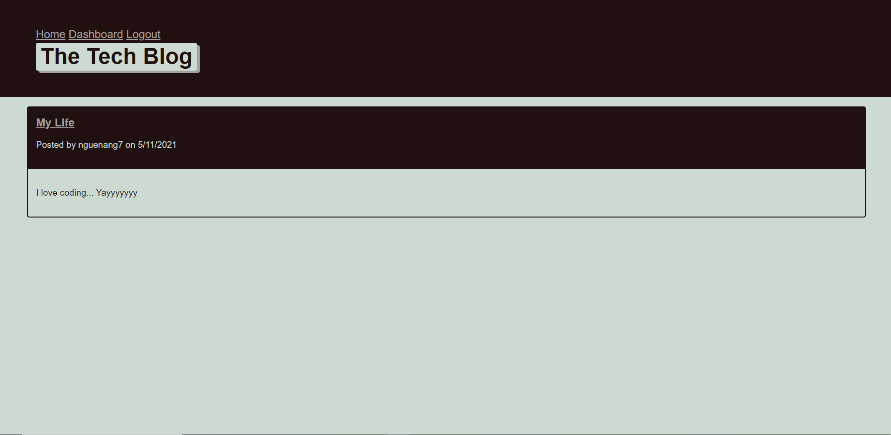
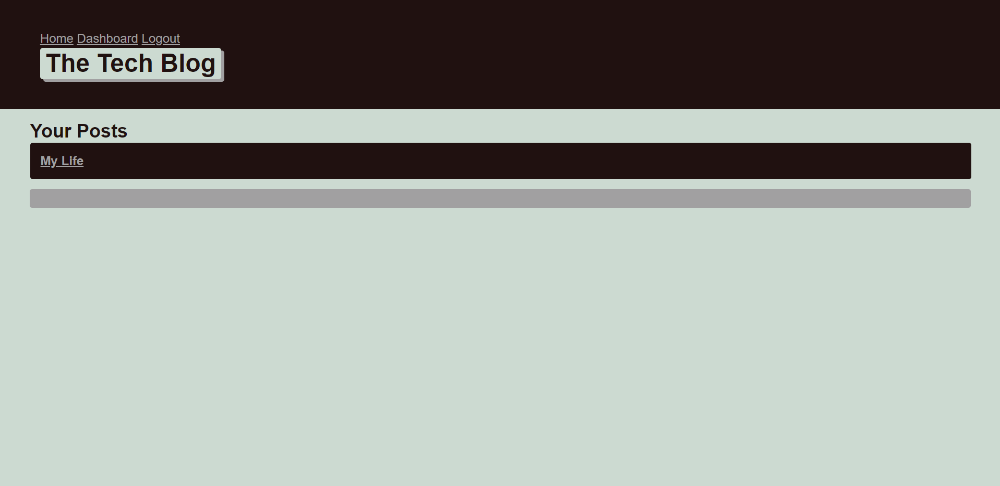
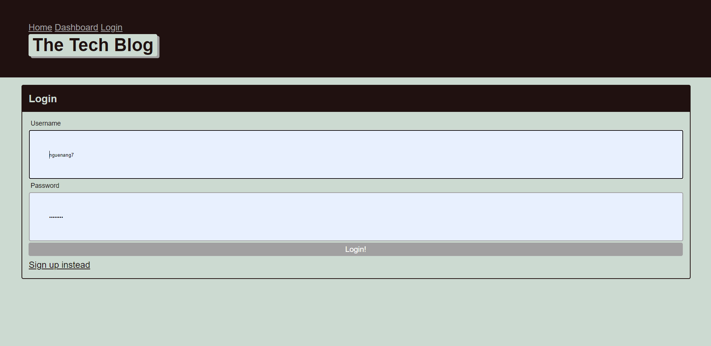

# Tech-Blog

## Table of Contents
* [Introduction](#introduction) 
* [Technology](#technology)
* [Demo Images](#demo-images)
* [Contact](#contact)
* [Links](#links)

## Introduction
Application that allows users to create an account, log in, access your dashboard and create new posts. Once there, others users an comment on it. The blogs gives users the ability to update or delete the post if needed. 

## Technolohy
> Node.js, Github, Heroku, npm packages, html, javascript, MySQL, Bootstrap, Bootswatch.

## Demo Images

 
 
 
 

## Contact
If you want to contact me you can reach me at njethur@gmail.com

## Links
[Heroku](https://polar-lowlands-87261.herokuapp.com/)  
[Github Profile](https://github.com/nguenang7)
